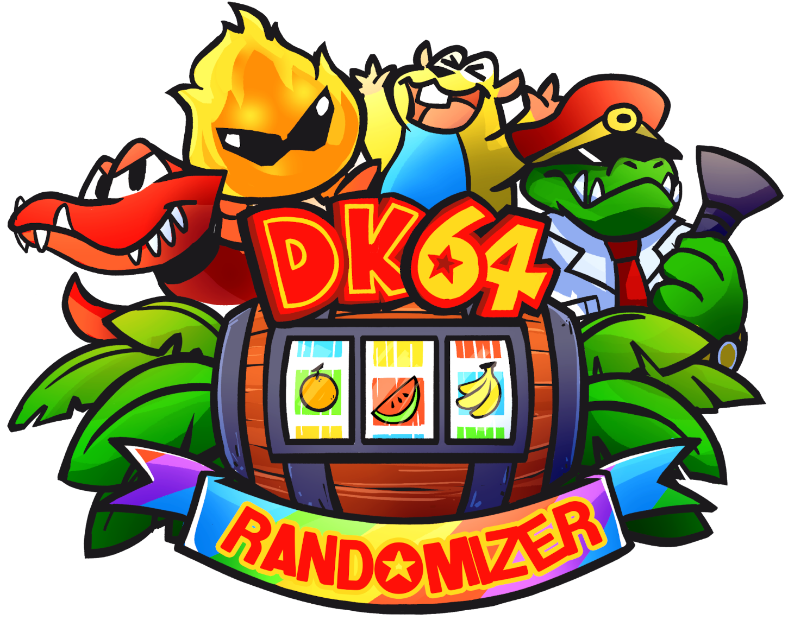

<div id="top"></div>
<br />
<div align="center">
  <a href="https://github.com/2dos/DK64-Randomizer">
    
  </a>

  <h3 align="center">DK64 Randomizer</h3>

  <p align="center">
    Python/C based builder and patching system for randomizing DK64 entirely within your browser.
    Randomizer by 2dos, Ballaam and Killklli
    <br />
    <a href="https://github.com/2dos/DK64-Randomizer/wiki"><strong>Explore the docs »</strong></a>
    <br />
    <br />
    <a href="https://dk64randomizer.com/">Live Site</a>
    ·
    <a href="https://dev.dk64randomizer.com/">Dev Site</a>
    ·
    <a href="https://github.com/2dos/DK64-Randomizer/issues">Report Bug/Features</a>
    ·
    <a href="https://discord.dk64randomizer.com">Discord</a>
  </p>
</div>

<details>
  <summary>Table of Contents</summary>
  <ol>
    <li>
      <a href="#about-the-project">About The Project</a>
    </li>
    <li>
      <a href="#getting-started">Getting Started</a>
      <ul>
        <li><a href="#building">Building</a></li>
      </ul>
    </li>
    <li><a href="#contributing">Contributing</a></li>
  </ol>
</details>

## About The Project

DK64 Randomizer is a simple to use web based application that can randomize and patch DK64 for you for a full featured adventure.
The application is entirely browser based in the end. All python code is run within your browser itself requiring only a webserver to serve the files and a local prebuilt version of your BPS file to patch for the base.

Current Features:

1. Randomizes the level order of DK64 (Hideout Helm always last)
      - The level lobby entrances and exits are randomized and tied together
      - Example: If Creepy Castle is level 1, then it only takes 1 GB to enter and 60 bananas to fight the boss under Vanilla rules
      - Validation to ensure the seed is able to be beaten glitchless
      - Unlock All Kongs must be turned on 
      - For logic purposes, in Galleon, the Peanut Popgun door that opens the sunken ship area is already opened
2. Options to modify the length of the game (changes the B Locker and Troff n Scoff counts)
      - Fully customizable B Locker and Troff n Scoff requirements per level
      - Four presets for each: Vanilla, Steady, Half and Hell
3. Option to unlock all kongs from the start
4. Option to unlock all moves from the start
5. Option to unlock the fairy camera and shockwave attack (fairy queen rewards) from the start
6. Option to enable the Tag Anywhere hack
7. Option for a fast Hideout Helm start
      - Start in Blast-o-matic room in front of Gorilla Grab lever
      - I-II-III-IV-V doors opened
      - The gates in front of the music pads are gone
8. Option to open the Crown door in Helm
9. Option to open the Nintendo and Rareware Coin door
      - Note that you cannot collect the DK Arcade GB with this option enabled, as the program simply adds the coins to your inventory
10. Option to enable quality-of-life changes
      - Removes first time text
      - Removes most cutscenes (including GB dances)
      - Removes first time boss cutscenes
      - Remove DK Rap and extra cutscenes from startup
      - Story skip set to "On" by default (not locked to on)
11. Option for Fast Start
      - Training Barrels complete
      - Start with Simian Slam
      - Spawn in DK Isles
      - Japes Lobby entrance open


<p align="right">(<a href="#top">back to top</a>)</p>

## Getting Started

Generally if you want to just run the application locally, you can download a pre build package from our releases or go directly to the live site.
If you want to build the application yourself and run it manually you can continue onto step two.


### Building

For the cases you want to build the app locally and run as a dev environment

1. Clone the repo
   ```sh
   git clone https://github.com/2dos/DK64-Randomizer.git
   ```
2. Building the patch file
   1. Download ```n64chain-windows.zip``` from [here](https://github.com/tj90241/n64chain/releases/tag/9.1.0)
   2. Extract to ```C:\n64chain```
   3. Add ```C:\n64chain\tools\bin``` to your system %path% environment variable
   4. Install ```Python 3```
   5. Git clone (or download a zip + extract) this repo to somewhere convenient
   6. Put ```dk64.z64``` (SHA1: CF806FF2603640A748FCA5026DED28802F1F4A50) in the ```./base-hack/rom``` subdirectory
   7. `cd ./base-hack`
   8. Run ```build.bat```
3.  Run Local Webserver
   ```sh
   python3 ./tools/NoCacheHTTPServer.py
   ```

<p align="right">(<a href="#top">back to top</a>)</p>


## Contributing

Contributions are what make the open source community such an amazing place to learn, inspire, and create. Any contributions you make are **greatly appreciated**.

If you have a suggestion that would make this better, please fork the repo and create a pull request. You can also simply open an issue with the tag "enhancement".
Don't forget to give the project a star! Thanks again!

1. Fork the Project
2. Create your Feature Branch (`git checkout -b feature/AmazingFeature`)
3. Commit your Changes (`git commit -m 'Add some AmazingFeature'`)
4. Push to the Branch (`git push origin feature/AmazingFeature`)
5. Open a Pull Request to Dev

<p align="right">(<a href="#top">back to top</a>)</p>
